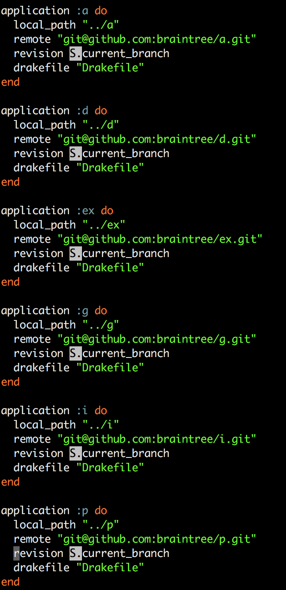

# Lessons learnt from "Shipping" containers.

Abejide Ayodele
bjhaid (twitter, github)

___

### Problems

- Builds were too slow (feedback cycle for developers was too long)
- Builds sometimes were not easily reproduceable between dev environment and Jenkins

___

### Core Objectives

- Make builds faster
- Make builds reproduceable

___

### The Quest

; some anime/gif on discovery of docker
___

### A brief about Docker niceities

- Docker Image/Dockerfile inheritance
- Docker Image caching
- Layer reuse
- Portability across machines
- Shareable
- Widely adopted (big community)

___

### Putting docker to use

- We heavily exploited docker's image/dockerfile inheritance. (note keep related non-moving portions in base images)

___

### Minimal dockerfile/image tree

                                         wheezy-base
                                             |
                                             |
-------------------------------------------------------------------------------------------------------------
|        |        |          |              |                  |          |          |          |           |
|        |        |          |              |                  |          |          |          |           |
rabbit redis  postgres-9.5  postgres-9.1  ruby-2.3            ruby-1.9   java-8    java-7   node-4.2.3    elixir
                                            |                   |           |                   |           |
                                            |                   |           |                   |           |
                                      ------------------        |     --------------        ---------       |
                                      |       |        |        |     |            |        |       |       |
                                  a-base     b-base   c-base  d-base clojure-base e-base  f-base   g-base h-base
                                      |       |        |        |     |            |        |       |       |
                                      a       b        c        d   i-base         e        f       g       h
                                                                      |
                                                                      i
___

### Flow
- Build an image
- Run tests
- Tag image with project name and current git sha
- Seed database
- Tag database image with project name and md5sum of migration and seed files
- Push image
- Trigger parameterized build of downstream builds passing the SHA through to them

___

### Early results
- Builds were amazingly faster

___

___

### Early results
- Builds were reproduceable
- Objectives achieved but...

___

;Some image of a daisy chain/duct taped things

___

- We were daisy-chaining Makefiles, bash files and docker-compose files
- Duplicating things across docker compose/Makefiles
- Which will be a bad UX for developers

___

### New Objective

- Replace the daisy chain with something better

___

### A DSL to replace compose files and Makefiles

- Written in a language familiar to Braintree Developers (ruby)
- Heavily inspired by rake
- Extendable in Ruby
- Reduced/_Removed_ duplication

___

___

___

- 221 lines of compose

___

### An example graph showing a build with links

___

### What I wish we knew

- Ensure UID/GID of user running docker is consistent with the user in the container
- `docker rm container` does not remove volumes, `docker rm -v container`
- `docker-compose rm` does not rm primary service
