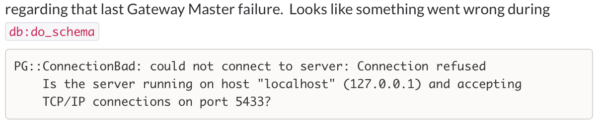

build-lists: true
# Lessons learnt from "Shipping" containers.

Abejide Ayodele
bjhaid (twitter, github)

---

### Problems

- Builds were too slow (feedback cycle for developers was too long)
- Builds sometimes were not easily reproduceable between dev environment and Jenkins
- Host where builds ran were mutated by builds and their dependencies

---


---


---



---

### Core Objectives

- Make builds faster
- Make builds reproduceable
- Make builds _host agnostic_

---

### The Quest


---


---

### A brief about Docker niceities

- Docker Image/Dockerfile inheritance
- Docker Image caching
- Layer reuse
- Portability across machines
- Shareable
- Widely adopted (big community)

---

### Putting docker to use

- We heavily exploited docker's image/dockerfile inheritance.

---

### Minimal dockerfile/image tree
```

                                         wheezy-base
                                             |
                                             |
-------------------------------------------------------------------------------------------------------------
|        |        |          |              |                  |          |          |          |           |
|        |        |          |              |                  |          |          |          |           |
rabbit redis  postgres-9.5  postgres-9.1  ruby-2.3            ruby-1.9   java-8    java-7   node-4.2.3    elixir
                                            |                   |           |                   |           |
                                            |                   |           |                   |           |
                                      ------------------        |     --------------        ---------       |
                                      |       |        |        |     |            |        |       |       |
                                  a-base     b-base   c-base  d-base clojure-base e-base  f-base   g-base h-base
                                      |       |        |        |     |            |        |       |       |
                                      a       b        c        d   i-base         e        f       g       h
                                                                      |
                                                                      i

```

^ note keep related non-moving portions in base images

---

### Docker Registry Architecture

```

                                               AWS S3
                                                  |
                    -----------------------------------------------------------
                    |                                                         |
                EC2 Registry                                                HaProxy
                    |                                                         |
     _   _   _   _   _   _   _                          --------------------------------------------
    |=| |=| |=| |=| |=| |=| |=|                         |                                          |
    |_| |_| |_| |_| |_| |_| |_|                       Nginx                                      Nginx
           EC2 WORKERS                                  |                                          |
                                                    Registry                                   Registry
                                                        |                                          |
                                                     -------------------------------------------------------
                                                     \_  \_  \_  \_  \_  \_  \_   \_  \_  \_  \_  \_  \_  \_
                                                     |=| |=| |=| |=| |=| |=| |=|  |=| |=| |=| |=| |=| |=| |=|
                                                     |_| |_| |_| |_| |_| |_| |_|  |_| |_| |_| |_| |_| |_| |_|
                                                                          PHYSICAL DC WORKERS
```
---
### Flow
- Build an image
- Run tests
- Seed database
- Commit project and database image
- Tag image with project name, current git sha and an extra branch tag

---

### Flow

- Tag database image with project name, md5sum of migration and seed files and an extra branch tag
- Push project and database image
- Trigger parameterized build of downstream builds passing the SHA through to them

---

### Early results
- Builds were reproduceable
- Builds were faster

---

### Successful builds on New(green) vs Old(red) CI (small is better)


---

Objectives achieved but...

---

### It came with other problems

- We were daisy-chaining Makefiles, bash files and docker-compose files
- Duplicating things across docker compose/Makefiles
- Which will be a bad UX for developers

---


---

### New Objective

- Replace the daisy chain with something better

---

### A DSL to replace compose files and Makefiles

- Written in a language familiar to Braintree Developers (ruby)
- Heavily inspired by rake
- Extendable in Ruby
- Reduced/_Removed_ duplication

---

```ruby
service :postgres do
  image "hub.braintree.com/bt/postgres:custom"
end
service :sample_app do
  image hub.braintree.com/bt/sample_app:master
end
job :test => [:sample_app, :postgres] do
  sample_app
    .link(:sample_app_db, postgres)
    .env("POSTGRES_HOST", "sample_app_db")
    .env("POSTGRES_PORT", "5433")
    .command("rake")
    .compose
    .run
end
```

---

```yaml
sample_app:
  command: "rake"
  environment:
    - DRAKE_HOST_USER_ID=1000
    - POSTGRES_HOST=sample_app_db
    - POSTGRES_PORT=5433
  image: hub.braintree.com/bt/sample_app:master
  links:
    - postgres:sample_app_db
postgres:
  environment:
    - DRAKE_HOST_USER_ID=1000
  image: hub.braintree.com/bt/postgres:custom
```

---

```ruby
application :sample_app do
  local_path "../sample_app"
  remote "github.com:braintree/sample_app.git"
  revision "final"
end
service :foo do
  image "hub.braintree.com/bt/foo:master"
end
job :test => ["sample_app:sample_app", "sample_app:postgres", :foo]
  foo
    .link(:sample_app, sample_app[:sample_app])
    .link(:postgres, sample_app[:postgres])
    .command("rake")
    .compose
    .run
end
```

---

```yaml
foo:
  command: "rake"
  environment:
    - DRAKE_HOST_USER_ID=1000
  image: hub.braintree.com/bt/foo:master
  links:
    - sample_app
    - postgres
sample_app:
  environment:
    - DRAKE_HOST_USER_ID=1000
  image: dockerhub.braintree.tools/bt/jenkins-grove-sample:87fbed05576406a2098fe8b173e62d578c6e7329
postgres:
  environment:
    - DRAKE_HOST_USER_ID=1000
  image: dockerhub.braintree.tools/bt/postgres:custom
```

---


---

^ 221 lines of compose


---


---


---

- Docker will create a directory as root if you specify a host directory as volume and the directory doesn't exist

---


---

## Tip

Ensure UID/GID of user running docker daemon (docker-compose) is consistent with the user in the container

                             OR

```bash
groupadd docker -g 918 \
&& sed -i "s#root:x:0:0:root:/root:/bin/bash#root:x:0:918:root:/root:/bin/bash#g" /etc/passwd
```
```yaml
command: "/bin/bash -c 'umask 0002 && mix do deps.get, clean, compile, ecto.create, ecto.migrate, test'"
```

---

`docker-compose rm` or `docker-compose stop` does not rm primary service

---

```yaml
foo:
  command: "/bin/bash -c 'sleep 1h'"
  environment:
    - REDIS_HOST=redis
  image: debian:wheezy
  links:
    - redis
  volumes:
    - /home/pair/bt/jumpman:/home/bt
redis:
  image: redis
```
---


---


---

### Transient docker networking problems correlating with preloading our VMs/AMIs with loads of docker images.

---

### Random kernel crashes (xen/docker/linux related)

^ compiling and running an aufs patched linx 3.18.36 made the problems disappear

---

### Shoutouts

- James
- Jaron
- Jeff
- Kevin

---

### Come work @ Braintree
